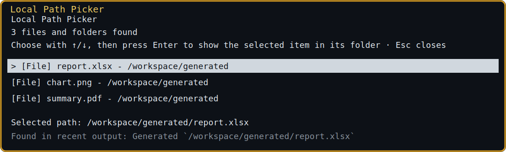

# Herdr Local Path Actions

[](https://github.com/yigitkg/herdr-open-local-paths/actions/workflows/ci.yml)
[](LICENSE)

Open files and folders mentioned in recent Herdr pane output without copying paths into File Explorer by hand.



The plugin scans the focused pane's last 120 lines. One existing path is handled immediately; several paths open a small picker. Files are shown before folders and repeated paths are listed once.

## Requirements

- Herdr 0.7.4 or newer
- Linux or WSL2
- Python 3.10 or newer available as `python3`
- `xdg-open` on desktop Linux, or Windows interoperability and `explorer.exe` in WSL

Native Windows and macOS are not declared supported in this release because the exact `python3` launcher and end-to-end workflow have not yet been verified there.

## Install

```bash
herdr plugin install yigitkg/herdr-open-local-paths
```

For development from this checkout:

```bash
herdr plugin link /absolute/path/to/herdr-open-local-paths
```

Add the shortcuts to your Herdr configuration:

```toml
[[keys.command]]
key = "prefix+alt+o"
type = "plugin_action"
command = "yigitkg.local-path-actions.open-latest-path"
description = "open a recent local path"

[[keys.command]]
key = "prefix+shift+o"
type = "plugin_action"
command = "yigitkg.local-path-actions.reveal-latest-path"
description = "show a recent local path in its folder"
```

Reload the Herdr configuration after editing it.

## Use

- `prefix+alt+o` opens the selected file with its default application. For a folder, it opens the folder.
- `prefix+shift+o` shows the selected file in File Explorer or the desktop file manager.
- In the picker, use `↑`/`↓` or `j`/`k`, then press `Enter`. `Esc` or `q` closes it.

The popup does not use `o`, `r`, or `c`. The shortcut used to launch it determines what `Enter` does.

Recognized forms include:

```text
/home/me/project/report.pdf
./output/report.csv
C:\Users\me\Desktop\chart.png
file:///home/me/project/index.html
`/home/me/My Reports/final report.xlsx`
[report](</home/me/My Reports/final report.xlsx>)
src/main.py:42:7
```

Paths containing spaces should be quoted, backticked, or used as a Markdown link destination. A candidate must exist locally when scanned.

## Safety

- Commands are passed as argument arrays; path text is not evaluated by a shell.
- Executable and high-risk file types such as `.exe`, `.cmd`, `.sh`, and `.desktop` are refused by the open action. Reveal the file instead.
- UNC/network paths are not probed because filesystem checks can block.
- SSH, Mosh, `docker`/`podman exec`, and `kubectl exec` panes are detected through Herdr process information. Open/reveal is refused in detected remote panes to avoid opening a same-named local file.
- If pane locality cannot be verified, relative paths fail closed. `LOCAL_PATH_ACTIONS_ALLOW_REMOTE=1` is an expert override and should only be used when you know the pane and path are local.
- Temporary picker data is private to the user, size- and count-bounded, single-use, and pruned after one hour.

Process-based remote detection cannot identify every nested remote tool. Do not open paths whose ownership you do not trust.

## Troubleshooting

No files appear:

- Confirm the path exists locally and appeared within the last 120 pane lines.
- Quote or backtick paths containing spaces.
- Use `prefix+alt+o` or `prefix+shift+o` from the pane containing the output.

The action fails:

- Confirm `python3 --version` reports 3.10 or newer.
- Confirm Herdr is 0.7.4 or newer.
- In WSL, confirm `explorer.exe .` opens File Explorer.
- A risky file must be revealed rather than opened.
- A relative path is refused when pane locality cannot be established.

Inspect recent plugin logs:

```bash
herdr plugin log list --plugin yigitkg.local-path-actions --limit 10
```

## Development

The plugin has no third-party Python dependencies.

```bash
python3 -m unittest discover -s tests -v
python3 -m py_compile src/local_path_actions.py src/path_picker.py
```

See [SECURITY.md](SECURITY.md) for vulnerability reporting and [CHANGELOG.md](CHANGELOG.md) for release history.

## License

[MIT](LICENSE)
